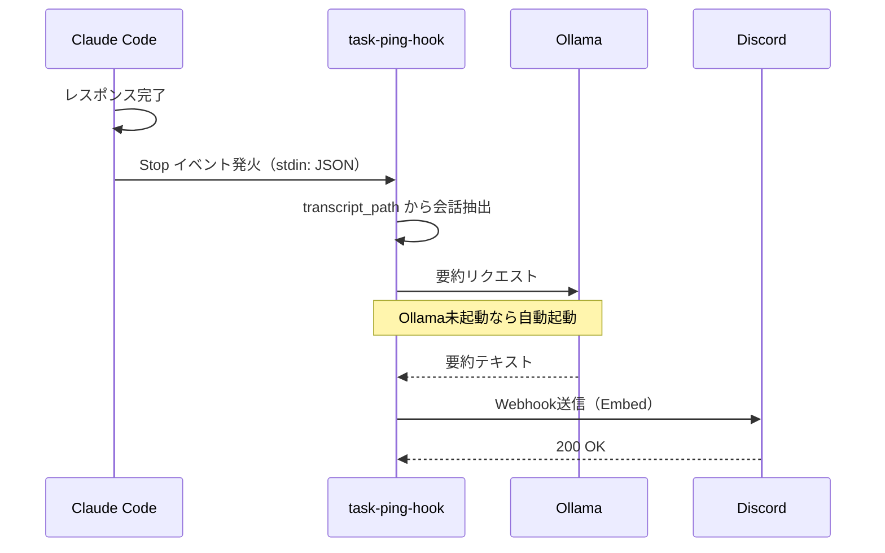

# システムアーキテクチャ

## 目的

このドキュメントはTaskPingのシステムアーキテクチャと処理フローを説明する。

## 全体構成

TaskPingは以下のコンポーネントで構成される：

| コンポーネント | 役割 |
|---------------|------|
| task-ping CLI | 手動通知送信 |
| task-ping-hook | Hooks連携用ハンドラ |
| notifier | Discord Webhook送信 |
| summarizer | LLMによる要約生成 |

## 処理フロー

## データフロー

### Stop イベント入力

Claude CodeからHooksに渡されるJSONデータ：

| フィールド | 説明 |
|-----------|------|
| session_id | セッション識別子 |
| transcript_path | 会話ログファイルのパス |
| hook_event_name | イベント名（"Stop"） |

### Discord Webhook出力

Discordに送信するペイロード：

| フィールド | 説明 |
|-----------|------|
| username | プロジェクト名（Bot名として表示） |
| embeds[].title | 通知タイトル（タイプに応じたアイコン付き） |
| embeds[].description | 要約テキスト |
| embeds[].color | 通知タイプに応じた色 |
| embeds[].timestamp | ISO 8601形式のタイムスタンプ |

## 通知タイプ

| タイプ | 色 | 用途 |
|-------|-----|------|
| success | 緑 (0x22c55e) | タスク完了 |
| error | 赤 (0xef4444) | エラー、失敗 |
| warning | 黄 (0xeab308) | レビュー依頼、警告 |
| info | 青 (0x3b82f6) | 一般情報 |

## 要約バックエンド

| バックエンド | 特徴 |
|-------------|------|
| Ollama | ローカル実行、無料、プライバシー確保 |
| Anthropic | クラウド実行、高品質、APIコスト発生 |

要約失敗時はフォールバックとして「作業完了」を表示。

## エラーハンドリング

| 状況 | 動作 |
|------|------|
| Ollama未起動 | 自動で `ollama serve` を起動（最大10秒待機） |
| 要約失敗 | フォールバックテキストを使用 |
| Webhook送信失敗 | エラーログ出力、Claude Code本体には影響なし |

## 関連ドキュメント

- @01-overview.md - プロジェクト概要
- @02-setup.md - セットアップ手順
